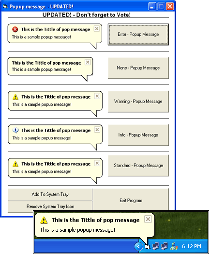



## Popup Balloon \- UPDATED\!

### Description

This is an Update of my Popup Balloon. It now supports Differenet Icons. (Warning, Error..) It Sends the program to the system tray and when you click on the command button it will show a popup balloon. - (See Screenshot) No OCX Files needed!
 
### More Info
 

             |
---                |---
**Submitted On**   |2004-10-31 03:27:02
**By**             |
**Level**          |Intermediate
**User Rating**    |5.0 (40 globes from 8 users)
**Compatibility**  |VB 6\.0
**Category**       |[Coding Standards](https://github.com/Planet-Source-Code/PSCIndex/blob/master/ByCategory/coding-standards__1-43.md)
**World**          |[Visual Basic](https://github.com/Planet-Source-Code/PSCIndex/blob/master/ByWorld/visual-basic.md)
**Archive File**   |[Popup\_Ball18122610312004\.zip](https://github.com/Planet-Source-Code/popup-balloon-updated__1-57007/archive/master.zip)

